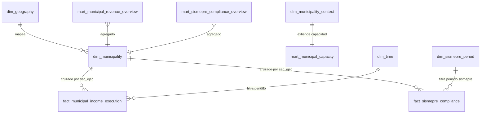

# Modelo Analítico Gold del Lakehouse

## Propósito

La capa **Gold** constituye la capa analítica final y optimizada del lakehouse local. Su objetivo es exponer tablas estables, comprensibles y eficientes para su consumo desde Power BI. A diferencia de las capas técnicas anteriores, Gold estructura la información en dimensiones, hechos y marts de datos de negocio, catalogados en Apache Hive y materializados en formato Parquet Snappy.

Este documento detalla el modelo de datos real implementado y registrado en el catálogo SQL de Hive.

Gold garantiza:
- **Respeto a las granularidades nativas:** Evita cruces fila-a-fila que distorsionen o dupliquen importes financieros o sismeprees.
- **Trazabilidad técnica:** Mantiene referencias a campos de auditoría (`gold_processed_at_utc`, `gold_grain`).
- **Exposición transparente de la cobertura:** Incorpora métricas específicas de integración para que Power BI reporte la calidad del cruce de datos de manera explícitamente auditable.
- **Acceso mediante Hive Server:** Las tablas están diseñadas para ser consumidas mediante ODBC de HiveServer2, con un fallback documentado directo a Parquet físicos o CSV en caso de inestabilidad local.

---

## Estructura del Modelo Gold

El modelo está organizado en tres grandes áreas temáticas: ingresos municipales (`municipal_revenue`), cumplimiento sismepre (`sismepre_compliance`) y contexto territorial (`territorial_context`), mapeadas en la base de datos `gold` de Hive Server.



---

## Catálogo de Tablas Gold

### 1. Dimensiones (Dimensions)

#### [dim_geography](file:///c:/Users/Windows%2011/Desktop/Proyectos/municipal-revenue-bigdata-analytics/data/gold/territorial_context/dim_geography)
* **Propósito:** Estandarizar la jerarquía político-administrativa (Departamento, Provincia, Distrito) a nivel nacional para la colocación de filtros jerárquicos y mapeo territorial.
* **Fuente Silver base:** `renamu_municipal_context`.
* **Granularidad:** Un registro por `ubigeo` nacional único.
* **Columnas principales:** `geography_key`, `ubigeo`, `ccdd`, `ccpp`, `ccdi`, `departamento_normalizado`, `provincia_normalizada`, `distrito_normalizado`, `is_valid_ubigeo`.
* **Uso en Power BI:** Filtro geográfico principal (Slicer) y mapas.
* **Limitaciones:** Representa la estructura territorial de ubigeos reportada formalmente en RENAMU.

#### [dim_municipality](file:///c:/Users/Windows%2011/Desktop/Proyectos/municipal-revenue-bigdata-analytics/data/gold/municipal_revenue/dim_municipality)
* **Propósito:** Registrar el universo municipal mapeando la relación técnica entre el código ejecutor presupuestal (`sec_ejec`) y el ubigeo territorial (`ubigeo`).
* **Fuente Silver base:** `municipal_entity_bridge` y `renamu_municipal_context`.
* **Granularidad:** Una fila por combinación válida de `sec_ejec` + `ubigeo` + `mapping_source`.
* **Columnas principales:** `municipality_key`, `sec_ejec`, `ubigeo`, `municipalidad_nombre`, `tipomuni_label`, `has_renamu_match`, `is_valid_sec_ejec`, `is_valid_ubigeo`.
* **Uso en Power BI:** Tabla de búsqueda (Lookup) para asociar hechos de ingresos (MEF) y predios a la geografía distrital.
* **Limitaciones:** Conserva flags de cobertura técnica. Si un `sec_ejec` carece de mapeo geográfico, `has_renamu_match` se expone como falso para no forzar cruces erróneos.

#### [dim_municipality_context](file:///c:/Users/Windows%2011/Desktop/Proyectos/municipal-revenue-bigdata-analytics/data/gold/territorial_context/dim_municipality_context)
* **Propósito:** Contextualizar las entidades municipales de RENAMU con atributos demográficos y de conformación institucional.
* **Fuente Silver base:** `renamu_municipal_context` y `municipal_entity_bridge`.
* **Granularidad:** Un registro por `ubigeo`.
* **Columnas principales:** `municipality_context_key`, `ubigeo`, `idmunici`, `tipomuni_label`, `has_municipal_identifier`, `sec_ejec_count`, `sismepre_sec_ejec_count`, `has_sismepre_match`.
* **Uso en Power BI:** Filtrado y clasificación institucional de municipalidades.
* **Limitaciones:** Depende de la declaración del cuestionario RENAMU.

#### [dim_sismepre_period](file:///c:/Users/Windows%2011/Desktop/Proyectos/municipal-revenue-bigdata-analytics/data/gold/sismepre_compliance/dim_sismepre_period)
* **Propósito:** Mapear la temporalidad y los ciclos operativos de la declaración y recolección del impuesto sismepre.
* **Fuente Silver base:** `sismepre_entity_period`.
* **Granularidad:** Combinación de `ano_aplicacion` + `periodo` + `ano_estadistica` + `mes_estadistica`.
* **Columnas principales:** `sismepre_period_key`, `ano_aplicacion`, `periodo`, `sismepre_period_label`.
* **Uso en Power BI:** Tabla de tiempo especializada para la línea de impuesto sismepre.
* **Limitaciones:** Los periodos son discontinuos según los años declarados operativamente por las municipalidades.

#### [dim_time](file:///c:/Users/Windows%2011/Desktop/Proyectos/municipal-revenue-bigdata-analytics/data/gold/municipal_revenue/dim_time)
* **Propósito:** Estandarizar el análisis de la ejecución presupuestal a nivel de año y mes de forma continua.
* **Fuente Silver base:** `fact_municipal_income_execution`.
* **Granularidad:** Un registro por `anio` y `mes`.
* **Columnas principales:** `period_key`, `anio`, `mes`, `is_annual_record`, `period_label`.
* **Uso en Power BI:** Dimensión temporal para análisis de evolución de recaudación de ingresos.
* **Limitaciones:** No se cuenta con granularidad diaria real; la ejecución mensualizada o acumulada anual es el estándar financiero.

---

### 2. Hechos (Facts)

#### [fact_municipal_income_execution](file:///c:/Users/Windows%2011/Desktop/Proyectos/municipal-revenue-bigdata-analytics/data/gold/municipal_revenue/fact_municipal_income_execution)
* **Propósito:** Hecho centralizado de presupuesto y ejecución de ingresos municipales por clasificador de ingresos detallado y periodo temporal.
* **Fuente Silver base:** `siaf_municipal_amounts`.
* **Granularidad:** `source_dataset` + `anio` + `mes` + `sec_ejec` + Clasificadores presupuestales (`rubro`, `generica`, `subgenerica`, `especifica`, etc.).
* **Columnas principales:** `monto_pia_total`, `monto_pim_total`, `monto_recaudado_total`, `recaudacion_vs_pia_ratio`, `recaudacion_vs_pim_ratio`, `pim_vs_pia_ratio`, `integration_quality_status`.
* **Uso en Power BI:** Sumarización y cálculo de tasas de avance de ingresos, desglosados por rubros y partidas presupuestarias.
* **Limitaciones:** Cerca de la mitad de las ejecutoras (`sec_ejec`) no cruzan con puente municipal, por lo que estas transacciones se exponen con `integration_quality_status = 'without_bridge'`.

#### [fact_sismepre_compliance](file:///c:/Users/Windows%2011/Desktop/Proyectos/municipal-revenue-bigdata-analytics/data/gold/sismepre_compliance/fact_sismepre_compliance)
* **Propósito:** Hecho principal para medir la emisión sismepre, recaudación ord/coactiva, saldos por cobrar y volumen de contribuyentes del impuesto sismepre.
* **Fuente Silver base:** `sismepre_entity_period`.
* **Granularidad:** `ano_aplicacion` + `periodo` + `sec_ejec` + `formulario_id` + `ano_estadistica` + `mes_estadistica`.
* **Columnas principales:** `sismepre_collection_total`, `sismepre_issue_total`, `sismepre_balance_total`, `taxpayer_count_total`, `property_count_total`, `sismepre_effectiveness_ratio`, columnas de origen monetarias (`mon_*_total`) y numéricas (`num_*_total`).
* **Uso en Power BI:** Cálculo de efectividad de cobranza sismepre y análisis de carteras morosas a nivel distrital y de periodos.
* **Limitaciones:** La granularidad incluye el ID de formulario y el mes estadístico para fines de trazabilidad.

#### [fact_revenue_integration_coverage](file:///c:/Users/Windows%2011/Desktop/Proyectos/municipal-revenue-bigdata-analytics/data/gold/municipal_revenue/fact_revenue_integration_coverage)
* **Propósito:** Exponer las métricas de cobertura técnica de integración del MEF sobre el universo presupuestal.
* **Fuente Silver base:** `integration_coverage`.
* **Granularidad:** Registro por métrica de cobertura.
* **Columnas principales:** `metric_name`, `numerator`, `denominator`, `coverage_percentage`, `description`.
* **Uso en Power BI:** Dashboard técnico de auditoría del lakehouse.
* **Limitaciones:** **Es una métrica técnica de calidad/integración de datos**, no representa desempeño municipal.

#### [fact_sismepre_integration_coverage](file:///c:/Users/Windows%2011/Desktop/Proyectos/municipal-revenue-bigdata-analytics/data/gold/sismepre_compliance/fact_sismepre_integration_coverage)
* **Propósito:** Reportar la cobertura e integridad de la información sismepre mapeada a nivel territorial distrital.
* **Fuente Silver base:** `integration_coverage`.
* **Granularidad:** Registro por métrica de cobertura sismepre.
* **Columnas principales:** `metric_name`, `numerator`, `denominator`, `coverage_percentage`.
* **Uso en Power BI:** Reporte técnico de auditoría.
* **Limitaciones:** **Es una métrica técnica de calidad de datos**, no de desempeño.

#### [fact_territorial_integration_coverage](file:///c:/Users/Windows%2011/Desktop/Proyectos/municipal-revenue-bigdata-analytics/data/gold/territorial_context/fact_territorial_integration_coverage)
* **Propósito:** Registrar las métricas de cobertura territorial y el cruce geográfico de distritos.
* **Fuente Silver base:** `integration_coverage`.
* **Granularidad:** Registro por métrica de integración territorial.
* **Columnas principales:** `metric_name`, `numerator`, `denominator`, `coverage_percentage`.
* **Uso en Power BI:** Reporte técnico de auditoría.
* **Limitaciones:** **Es una métrica de calidad de datos**, no representa desempeño de gestión.

---

### 3. Marts de Negocio (Marts)

#### [mart_municipal_capacity](file:///c:/Users/Windows%2011/Desktop/Proyectos/municipal-revenue-bigdata-analytics/data/gold/territorial_context/mart_municipal_capacity)
* **Propósito:** Consolidar métricas de capacidades institucionales de las municipalidades (personal contratado, computadoras, conectividad y disponibilidad de sistemas de administración tributaria y catastro) para analizar brechas operativas.
* **Fuente Silver base:** `renamu_full` (Silver completo: `base_renamu_2022`) y `dim_municipality_context` (Gold).
* **Granularidad:** Un registro por `ubigeo` (municipalidad).
* **Columnas principales:** `total_personal_mar_2022`, `total_computadoras_operativas`, `ratio_computadoras_con_internet`, `tiene_internet`, `tiene_siaf`, `tiene_srtm`, `tiene_sistema_rentas`, `tiene_catastro`, `requiere_asistencia_administracion_tributaria`, `requiere_asistencia_catastro`, `renamu_income_total`, `renamu_expense_total`.
* **Uso en Power BI:** Cruce de capacidad tecnológica e institucional con la efectividad de recaudación sismepre o ingresos para identificar municipalidades críticas en un análisis multidimensional de cuadrantes.
* **Limitaciones:** Basado en el censo institucional de RENAMU 2022.

#### [mart_municipal_revenue_overview](file:///c:/Users/Windows%2011/Desktop/Proyectos/municipal-revenue-bigdata-analytics/data/gold/municipal_revenue/mart_municipal_revenue_overview)
* **Propósito:** Proporcionar una vista agregada y rápida de los ingresos municipales a nivel de entidad y periodo para optimizar el rendimiento del reporte en Power BI.
* **Fuente Gold base:** `fact_municipal_income_execution`.
* **Granularidad:** `anio` + `mes` + `sec_ejec` + `ubigeo`.
* **Columnas principales:** `monto_pia_total`, `monto_pim_total`, `monto_recaudado_total`, `recaudacion_vs_pia_ratio`, `recaudacion_vs_pim_ratio`, `integration_quality_status`.
* **Uso en Power BI:** Gráficos de tendencias, resúmenes temporales de avance presupuestal y tarjetas KPI principales de ingresos.
* **Limitaciones:** No incluye los desgloses presupuestales (partidas de clasificadores) para evitar sobrecargar la memoria.

#### [mart_sismepre_compliance_overview](file:///c:/Users/Windows%2011/Desktop/Proyectos/municipal-revenue-bigdata-analytics/data/gold/sismepre_compliance/mart_sismepre_compliance_overview)
* **Propósito:** Agregar las variables clave del impuesto sismepre por entidad y periodo operativo eliminando el detalle de formularios.
* **Fuente Gold base:** `fact_sismepre_compliance`.
* **Granularidad:** `ano_aplicacion` + `periodo` + `sec_ejec` + `effective_ubigeo`.
* **Columnas principales:** `sismepre_collection_total`, `sismepre_issue_total`, `sismepre_balance_total`, `taxpayer_count_total`, `property_count_total`, `sismepre_effectiveness_ratio`.
* **Uso en Power BI:** Dashboards principales de cobranza sismepre.
* **Limitaciones:** Agrupado a nivel de periodo y entidad ejecutora.

#### [mart_sismepre_ranking](file:///c:/Users/Windows%2011/Desktop/Proyectos/municipal-revenue-bigdata-analytics/data/gold/sismepre_compliance/mart_sismepre_ranking)
* **Propósito:** Clasificar y ordenar las municipalidades según volumen y efectividad de recaudación sismepre por año y periodo para evaluaciones comparativas de desempeño.
* **Fuente Gold base:** `mart_sismepre_compliance_overview`.
* **Granularidad:** `ano_aplicacion` + `periodo` + `sec_ejec`.
* **Columnas principales:** `collection_rank_desc`, `collection_rank_asc`, `effectiveness_rank_desc`, `balance_rank_desc`, `is_top_collection_candidate`, `is_bottom_collection_candidate`.
* **Uso en Power BI:** Tablas de ranking y visualización de líderes de recaudación.
* **Limitaciones:** El ranking se calcula independientemente para cada combinación de año y periodo.

#### [mart_territorial_context](file:///c:/Users/Windows%2011/Desktop/Proyectos/municipal-revenue-bigdata-analytics/data/gold/territorial_context/mart_territorial_context)
* **Propósito:** Agregar métricas del cruce municipal-territorial por distritos y provincias para análisis y auditoría territorial.
* **Fuente Gold base:** `dim_municipality_context`.
* **Granularidad:** `ubigeo` y tipo de municipalidad.
* **Columnas principales:** `municipality_count`, `valid_ubigeo_count`, `complete_territory_count`, `sismepre_match_count`, `without_sismepre_match_count`.
* **Uso en Power BI:** Soporte geográfico para mapas de integración y visualización nacional de brechas.
* **Limitaciones:** No contiene importes financieros.

---

## Estrategia de Consumo en Power BI y Fallback

1. **Consumo Recomendado (Hive ODBC):**
   Power BI debe consumir preferentemente las tablas de la base de datos `gold` expuestas por HiveServer2. Esta conexión permite catalogar de forma nativa las tablas externas estructuradas, delegando el peso del procesamiento analítico a Hive y reduciendo el volumen de importación en memoria de Power BI.
2. **Uso Técnico de Capas Anteriores:**
   Las bases de datos `bronze` y `silver` registradas en Hive quedan reservadas como capas de auditoría, calidad de datos e ingeniería. **No deben ser expuestas en el modelo final de cara al usuario de negocio** para evitar inconsistencias en el reporte o cruces incorrectos.
3. **Estrategia de Fallback Controlada:**
   Si la conexión local mediante el driver ODBC de Hive experimentase inestabilidad, bloqueos de red o problemas de compatibilidad local del controlador ODBC en el sistema anfitrión, Power BI puede utilizar la contingencia consistente en:
   - Carga directa desde los archivos físicos Parquet locales en `data/gold/` o
   - Carga de los archivos CSV auxiliares exportados localmente.

## Nota de transición para el rediseño Gold

Los marts Gold existentes deben tratarse como referencia transicional hasta cerrar el nuevo Silver basado en profiling. El rediseño Gold debe partir de:

```text
fact_siaf_income
fact_sismepre_predial_statistics
fact_sismepre_response
fact_renamu_municipal_context
dim_municipality
dim_time
dim_siaf_classifier
dim_sismepre_form
dim_sismepre_question
dim_municipal_category
```

La clasificación municipal oficial del MEF debe entrar mediante `dim_municipality` o el puente municipal usando `ubigeo6`. No debe degradarse a un join directo por nombre cuando exista llave territorial disponible.
