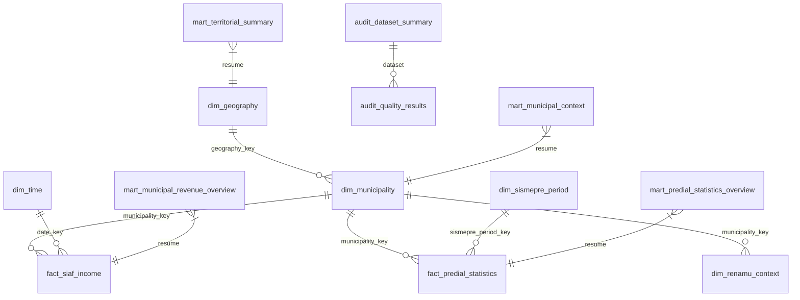

# Modelo Gold objetivo

## Propósito

Este documento define la arquitectura objetivo de la capa **Gold** del proyecto `municipal-revenue-bigdata-analytics`.

La arquitectura ya no se organiza como Bronze/Silver por fuente ni como un conjunto de puentes transitorios para negocio. El estado cerrado del proyecto es este:

- **Silver integrado** prepara los datos limpios, tipados y trazables.
- **Gold dimensional** expone las dimensiones, hechos y marts finales.
- **Hive** cataloga las tablas externas.
- **Power BI** consume los marts y dimensiones finales.

Este documento describe el modelo objetivo. No implica que todas las tablas físicas ya estén construidas en este commit.

## Principios cerrados

1. `municipal_categories` es legacy. La fuente vigente es `municipal_classification`, basada en la clasificación municipal oficial MEF 2019.
2. RENAMU completo no debe volver a Gold. El contexto RENAMU se separa en `dim_renamu_context`.
3. `dim_municipality` representa la entidad municipal o institucional. La jerarquía territorial vive en `dim_geography`.
4. `map_sec_ejec_ubigeo` es un mapa técnico Silver, no una dimensión de negocio.
5. `fact_siaf_income` debe salir con `municipality_key` ya resuelto.
6. SISMEPRE inicial solo usa `silver/sismepre/resource_key=esat_estadistica_atm`.
7. La clasificación municipal oficial se resuelve por `ubigeo6`, no por matching manual por nombre.

## Esquema objetivo

## Dimensiones y contexto

### `dim_municipality`

Representa la entidad municipal/institucional.

Campos objetivo:

- `municipality_key`
- `ubigeo6`
- `geography_key`
- `idmunici`
- `tipomuni_codigo`
- `tipomuni_nombre`
- `tipo_clasificacion_municipal`
- `ambito_municipal`
- `descripcion_tipo`

Reglas:

- `geography_key` puede ser igual a `ubigeo6` para mantener simplicidad.
- No debe repetir departamento, provincia y distrito como atributos principales.
- No debe mezclar contexto territorial con contexto institucional.

### `dim_geography`

Representa la jerarquía territorial.

Campos objetivo:

- `geography_key`
- `ubigeo6`
- `ccdd`
- `ccpp`
- `ccdi`
- `departamento_nombre`
- `provincia_nombre`
- `distrito_nombre`

Reglas:

- `geography_key` puede ser igual a `ubigeo6`.
- Su granularidad es una fila por unidad territorial.
- No debe incorporar atributos institucionales municipales.

### `dim_renamu_context`

Representa el contexto RENAMU seleccionado para negocio.

Campos objetivo:

- `municipality_key`
- `ubigeo6`
- variables RENAMU seleccionadas

Reglas:

- Se limita a variables útiles para interpretación de contexto.
- No replica toda la tabla RENAMU.
- No debe insertarse dentro de `dim_municipality`.

### `dim_time`

Calendario mensual para SIAF.

Campos objetivo:

- `date_key`
- `fecha_mes`
- `anio`
- `mes`
- `anio_mes`
- `trimestre`
- `semestre`

### `dim_sismepre_period`

Calendario operativo de SISMEPRE.

Campos objetivo:

- `sismepre_period_key`
- `anio_aplicacion`
- `periodo`
- `anio_estadistica`
- `mes_estadistica`
- `periodo_estadistica_tipo`
- `is_annual_stat_period`
- `periodo_label`

## Mapa técnico Silver

### `map_sec_ejec_ubigeo`

Mapa técnico de trazabilidad y resolución territorial.

Campos objetivo:

- `sec_ejec`
- `ubigeo6`
- `municipality_key`
- `municipalidad_sismepre_nombre`
- `municipalidad_siaf_nombre`
- `has_siaf_match`
- `has_sismepre_match`
- `has_renamu_match`
- `has_classification_match`
- `match_status`
- `confidence_level`
- `issue_reason`

Reglas:

- Se documenta como Silver técnico.
- Sirve para resolver `sec_ejec -> ubigeo6 -> municipality_key`.
- No debe usarse como tabla principal de Power BI.
- No debe exponerse como dimensión de negocio.

## Hechos Gold

### `fact_siaf_income`

Hecho de ingresos y ejecución municipal.

Campos objetivo:

- `municipality_key`
- `sec_ejec`
- `date_key`
- `source_resource_key`
- `source_granularity`
- `monto_pia`
- `monto_pim`
- `monto_recaudado`
- `has_municipality_match`
- `match_status`

Reglas:

- Debe salir con `municipality_key` ya resuelto usando `map_sec_ejec_ubigeo`.
- Power BI no debe depender del mapa técnico como tabla intermedia para análisis normal.

### `fact_predial_statistics`

Hecho inicial de estadísticas SISMEPRE.

Campos objetivo:

- `municipality_key`
- `sismepre_period_key`
- `sec_ejec`
- `ubigeo6`
- `formulario_id`
- `monto_emision_predial_total`
- `monto_recaudacion_predial_total`
- `monto_saldo_predial_total`
- `ratio_recaudacion_emision`
- `numero_predios_total`
- `numero_contribuyentes_predio`

Reglas:

- El Gold inicial solo consume `silver/sismepre/resource_key=esat_estadistica_atm`.
- Los recursos SISMEPRE restantes quedan en Silver por trazabilidad, pero no entran al Gold inicial ni al dashboard principal.

## Marts Gold para Power BI

### `mart_municipal_revenue_overview`

Vista ejecutiva de ingresos municipales.

Uso:

- KPIs principales.
- Tendencias.
- Comparativos por municipio y periodo.

### `mart_predial_statistics_overview`

Vista ejecutiva de SISMEPRE.

Uso:

- Emisión, recaudación, saldo y ratios.
- Análisis por periodo y entidad municipal.

### `mart_municipal_context`

Vista de contexto municipal e institucional.

Uso:

- Lectura rápida de clasificación municipal.
- Variables seleccionadas de RENAMU.

### `mart_territorial_summary`

Vista de resumen territorial.

Uso:

- Jerarquía geográfica.
- Agregaciones por departamento, provincia y distrito.

## Auditoría y calidad

El modelo de auditoría y calidad debe mantenerse separado del modelo de negocio.

### `audit_quality_results`

Resultado detallado por regla.

Campos mínimos:

- `dataset`
- `rule_name`
- `status`
- `severity`
- `message`
- `pass_count`
- `warning_count`
- `fail_count`
- `completeness_score`
- `validity_score`
- `conformity_score`
- `duplicate_rows`
- `null_percentage`
- `row_count`
- `processed_at_utc`

### `audit_dataset_summary`

Resumen por dataset evaluado.

Campos mínimos:

- `dataset`
- `datasets_evaluados`
- `row_count`
- `duplicate_rows`
- `null_percentage`
- `pass_count`
- `warning_count`
- `fail_count`
- `processed_at_utc`

## Legacy y reemplazos

Las siguientes referencias deben considerarse legacy o transición anterior:

- `municipal_entity_bridge`
- `mef_municipal_amounts`
- `renamu_full`
- `renamu_municipal_context`
- `fact_municipal_income_execution`
- `dim_municipality_context`
- `fact_predial_compliance`
- `fact_revenue_integration_coverage`

También quedan legacy las referencias a:

- `municipal_categories`
- `categorias_municipalidades`
- `CategoriasMunicipalidades.csv`
- matching manual por nombre como criterio principal de integración

## Consumo en Hive y Power BI

- Hive registra las tablas Gold como tablas externas.
- Power BI consume preferentemente `mart_municipal_revenue_overview`, `mart_predial_statistics_overview`, `mart_municipal_context` y `mart_territorial_summary`.
- `map_sec_ejec_ubigeo` se mantiene para trazabilidad técnica y depuración.
- Los modelos de auditoría se usan para calidad, no para análisis de negocio.

## Resumen operativo

El modelo objetivo queda cerrado así:

- Silver integrado resuelve y limpia.
- Gold dimensional separa entidad, geografía, RENAMU y tiempo.
- SIAF sale por `fact_siaf_income`.
- SISMEPRE inicial sale por `fact_predial_statistics`.
- RENAMU queda en `dim_renamu_context`.
- La clasificación municipal oficial vive en `dim_municipality`.
- La auditoría vive aparte en `audit_quality_results` y `audit_dataset_summary`.
