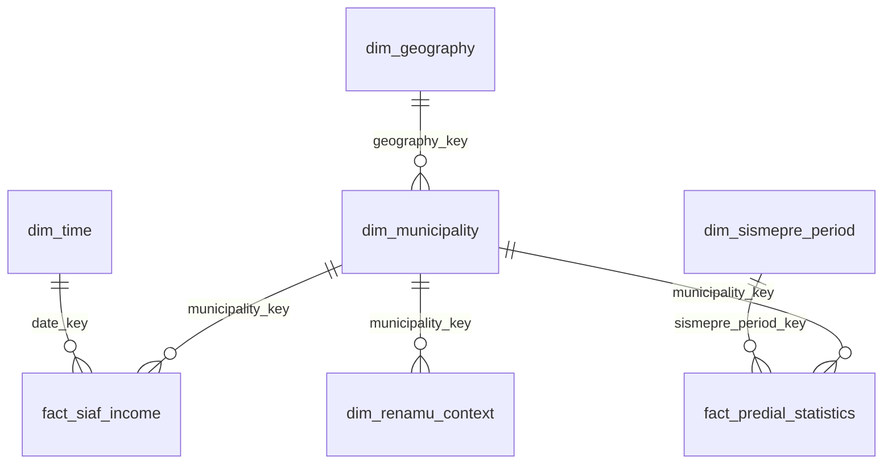

# Modelo semántico Power BI objetivo

## Propósito

Este documento define el modelo semántico objetivo de Power BI para el proyecto `municipal-revenue-bigdata-analytics`.

La meta es consumir la capa Gold dimensional final sin exponer tablas técnicas innecesarias. El modelo debe quedar orientado a negocio, con dimensiones claras, hechos estables, marts ejecutivos y un bloque de auditoría separado.

## Regla base

Power BI debe consumir preferentemente:

- `mart_municipal_revenue_overview`
- `mart_predial_statistics_overview`
- `mart_municipal_context`
- `mart_territorial_summary`
- `dim_municipality`
- `dim_geography`
- `dim_time`
- `dim_sismepre_period`
- `dim_renamu_context`
- `audit_quality_results`
- `audit_dataset_summary`

No debe depender de:

- `map_sec_ejec_ubigeo` como tabla de análisis normal
- `municipal_entity_bridge`
- `mef_municipal_amounts`
- `renamu_full`
- `renamu_municipal_context`
- `fact_municipal_income_execution`

## Diseño del modelo

### Dimensiones

1. `dim_municipality`
2. `dim_geography`
3. `dim_time`
4. `dim_sismepre_period`
5. `dim_renamu_context`

### Hechos

1. `fact_siaf_income`
2. `fact_predial_statistics`

### Marts

1. `mart_municipal_revenue_overview`
2. `mart_predial_statistics_overview`
3. `mart_municipal_context`
4. `mart_territorial_summary`

### Auditoría

1. `audit_quality_results`
2. `audit_dataset_summary`

## Relaciones recomendadas

Reglas:

- Relaciones 1:N unidireccionales.
- Evitar many-to-many.
- Evitar usar textos de nombre como llave de relación.
- `geography_key` puede ser igual a `ubigeo6`.
- `municipality_key` debe ser estable y consistente entre hechos y dimensiones.

## Rol de cada tabla

### `dim_municipality`

Sirve para segmentación institucional y clasificación municipal.

No debe repetir la jerarquía territorial principal.

### `dim_geography`

Sirve para filtros jerárquicos de territorio.

No debe cargar atributos institucionales.

### `dim_renamu_context`

Sirve para contexto operativo seleccionado desde RENAMU.

No es una réplica completa del dataset RENAMU.

### `dim_time`

Sirve para el análisis continuo de ingresos SIAF.

### `dim_sismepre_period`

Sirve para el calendario operativo de SISMEPRE.

### `fact_siaf_income`

Hecho principal para ingresos municipales.

Debe llegar con `municipality_key` resuelto para evitar cruces manuales en Power BI.
Debe exponer `date_key` y `match_status` ya resueltos desde Gold, sin obligar al reporte a usar `map_sec_ejec_ubigeo`.

### `fact_predial_statistics`

Hecho principal para estadísticas prediales iniciales.

Debe consumir únicamente el recurso objetivo de SISMEPRE definido para el Gold inicial.

### `mart_municipal_revenue_overview`

Tabla ejecutiva para KPI, tendencia y comparativos.

### `mart_predial_statistics_overview`

Tabla ejecutiva para emisión, recaudación y saldo predial.

### `mart_municipal_context`

Tabla de contexto institucional para clasificación y variables RENAMU seleccionadas.

### `mart_territorial_summary`

Tabla de síntesis geográfica.

### `audit_quality_results` y `audit_dataset_summary`

Tablas de control técnico.

No deben mezclarse con la navegación del análisis de negocio.

## Modelo semántico recomendado

La navegación del reporte debe concentrarse en los marts. Las dimensiones sólo deben usarse cuando aporten segmentación o jerarquía clara.

No se recomienda exponer al usuario final:

- el mapa técnico Silver
- puentes intermedios
- tablas de cobertura
- tablas de integración transitoria

## Páginas recomendadas

### 1. Resumen de ingresos municipales

Fuentes:

- `mart_municipal_revenue_overview`
- `dim_municipality`
- `dim_geography`
- `dim_time`

### 2. Estadísticas prediales

Fuentes:

- `mart_predial_statistics_overview`
- `dim_municipality`
- `dim_sismepre_period`

### 3. Contexto municipal

Fuentes:

- `mart_municipal_context`
- `dim_municipality`
- `dim_renamu_context`

### 4. Resumen territorial

Fuentes:

- `mart_territorial_summary`
- `dim_geography`

### 5. Auditoría y calidad

Fuentes:

- `audit_quality_results`
- `audit_dataset_summary`

## Medidas DAX

Las medidas deben construirse sobre las tablas ejecutivas y los hechos finales, no sobre mapas técnicos.

Ejemplos de contrato:

- `PIA Total` sobre `mart_municipal_revenue_overview`
- `PIM Total` sobre `mart_municipal_revenue_overview`
- `Recaudacion Total` sobre `mart_municipal_revenue_overview`
- `Emision Predial Total` sobre `mart_predial_statistics_overview`
- `Recaudacion Predial Total` sobre `mart_predial_statistics_overview`
- `Saldo Predial Total` sobre `mart_predial_statistics_overview`
- `Efectividad Predial` como ratio entre recaudación y emisión

Las medidas de auditoría deben permanecer separadas:

- `pass_count`
- `warning_count`
- `fail_count`
- `completeness_score`
- `validity_score`
- `conformity_score`
- `duplicate_rows`
- `null_percentage`
- `row_count`
- `datasets_evaluados`
- `processed_at_utc`

## Legacy explícito

Se consideran legacy para Power BI:

- `dim_municipality_context`
- `fact_municipal_income_execution`
- `fact_predial_compliance`
- `mart_municipal_capacity`
- `mart_sismepre_ranking`
- `municipal_categories`
- `categorias_municipalidades`
- `CategoriasMunicipalidades.csv`

Esos nombres pueden seguir apareciendo en documentos viejos o en código heredado, pero no forman parte del contrato objetivo del reporte final.
